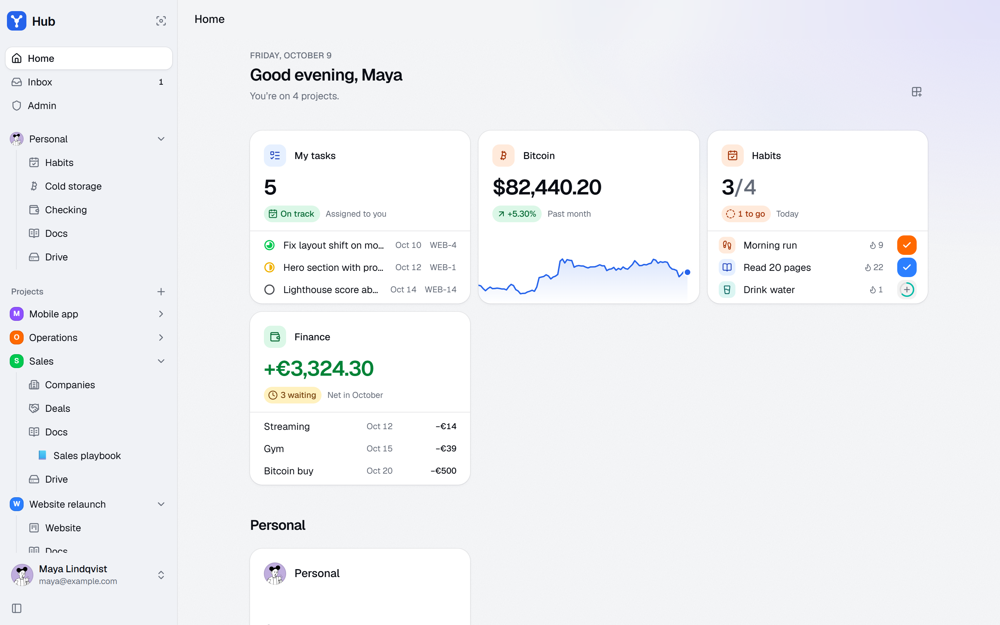
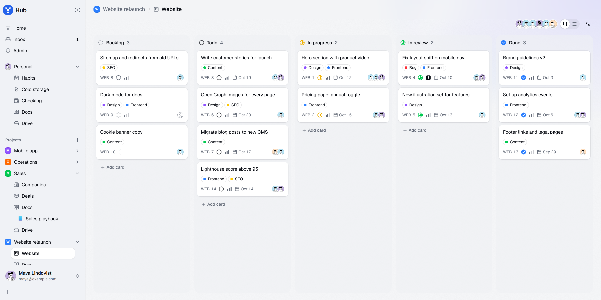
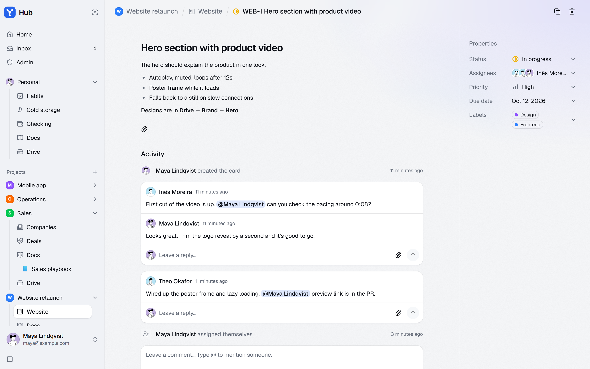
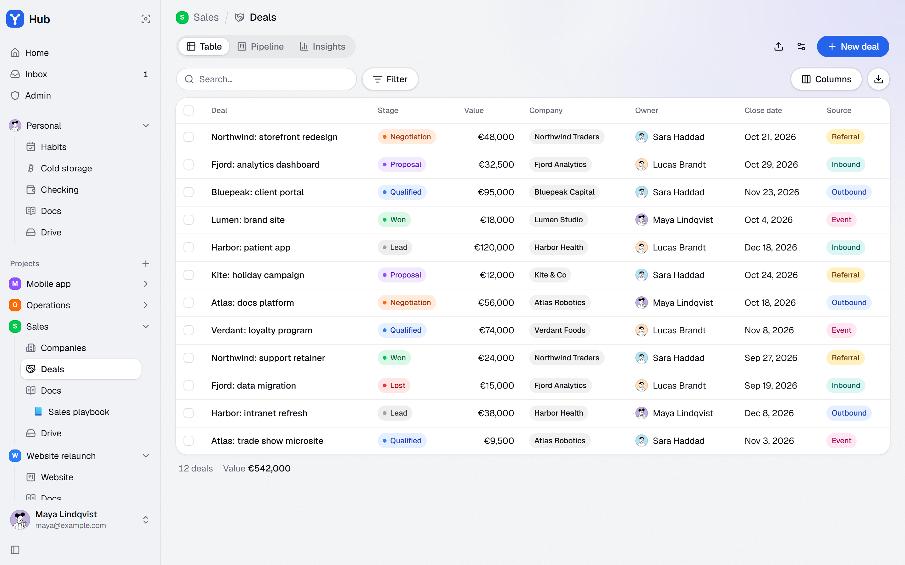
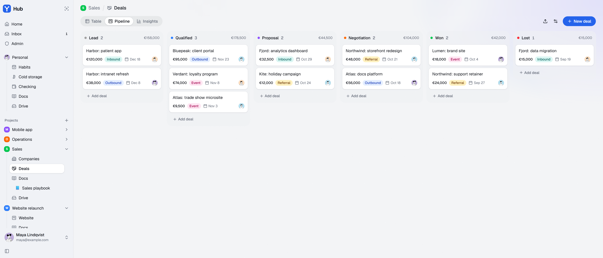
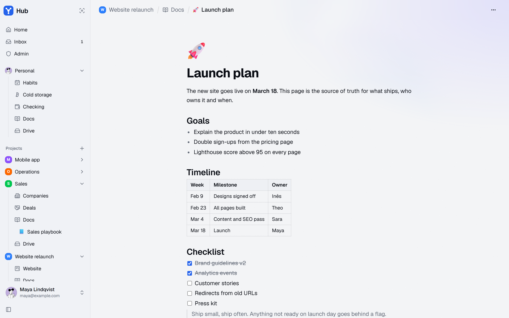
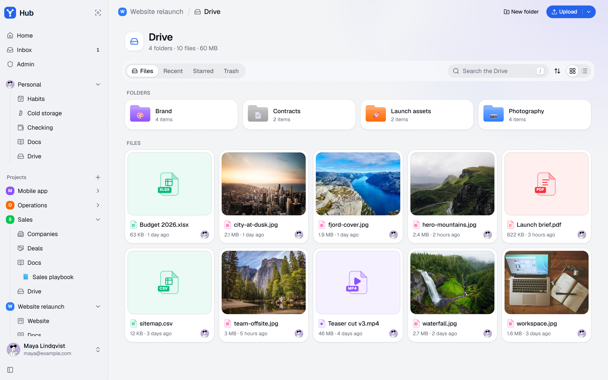
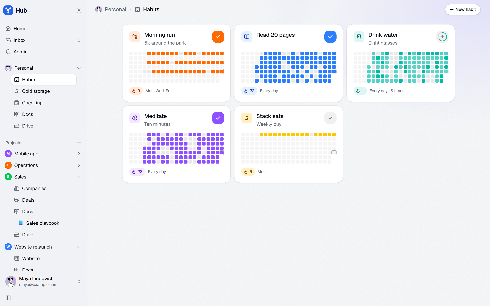
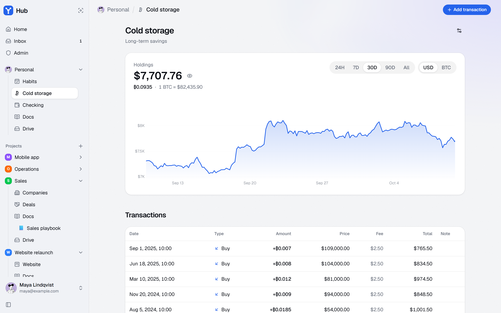
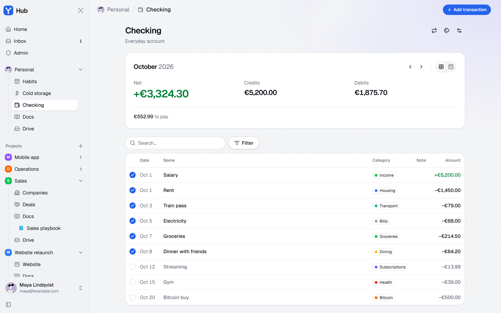

<div align="center">
<h1>Hub</h1>
<p>Everything your team works on, in one place</p>
</div>

Hub is the team workspace that grew out of [Freehub](../freehub): the same screens and feel, with a Convex backend instead of Nostr relays, email and password accounts, invite-only sign-up, files on Cloudflare R2 and per-project access.

## Screenshots

<details>
<summary>Show screenshots</summary>

<br />





















</details>

## Getting started

### Requirements

- [Node](https://nodejs.org/) 22+
- [pnpm](https://pnpm.io/installation)
- A [Convex](https://convex.dev) project
- A [Cloudflare R2](https://developers.cloudflare.com/r2/) bucket, for photos, images in docs and Drive files
- Optionally, an [OpenRouter](https://openrouter.ai) key, for AI features like reading invoices

### 1. Install

```bash
pnpm install
```

### 2. Connect Convex

```bash
pnpm dev:convex
```

Pick your Convex project and leave it running: it pushes the functions in `convex/` on every save and keeps `convex/_generated` up to date.

### 3. Set up auth keys

Convex Auth signs sessions with a key pair. With step 2 done (it needs the `CONVEX_DEPLOYMENT` that `npx convex dev` writes to `.env.local`), run in another terminal:

```bash
npx @convex-dev/auth
```

It sets `JWT_PRIVATE_KEY`, `JWKS` and `SITE_URL` on the deployment. Use `http://localhost:5173` as the site URL for development. The code it would generate is already in the repo, so skip any step that offers to write files.

### 4. Set up R2

1. Create a bucket, and an API token with **Object Read & Write** on it.
2. Give the bucket a CORS policy that lets the app upload:

   ```json
   [
     {
       "AllowedOrigins": [
         "http://localhost:5173",
         "https://your-hub.example.com"
       ],
       "AllowedMethods": ["GET", "PUT"],
       "AllowedHeaders": ["Content-Type"]
     }
   ]
   ```

3. Set the token on the deployment:

   ```bash
   npx convex env set R2_TOKEN xxxxx
   npx convex env set R2_ACCESS_KEY_ID xxxxx
   npx convex env set R2_SECRET_ACCESS_KEY xxxxx
   npx convex env set R2_ENDPOINT xxxxx
   npx convex env set R2_BUCKET xxxxx
   ```

Everything but uploads works without R2.

### 5. Set up AI (optional)

```bash
npx convex env set OPENROUTER_API_KEY sk-or-xxxxx
```

Admins pick the model for each task in **Admin**. Without a key, files still attach to transactions, but nothing reads them.

### 6. Run

```bash
pnpm dev            # vite on http://localhost:5173
```

Create the first account: it becomes the admin. Invite the rest of the team from **Admin**, then create a project and assign them to it.

### Checks

```bash
pnpm typecheck      # the app and the Convex functions
pnpm check          # oxlint and oxfmt, through ultracite
pnpm fix            # the same, fixing what it can
pnpm build          # type-check and build to dist/
```

## Releasing

Production deploys only from version tags. Pushing to `main` alone deploys nothing.

1. Commit changes.
2. Run the `/release` skill.
3. `git push --follow-tags`. The tag runs the Release workflow: Convex, then Vercel.

The version shows at the foot of the sidebar. To roll back, run the Release workflow from an older tag.

The workflow needs the `CONVEX_DEPLOY_KEY`, `VERCEL_TOKEN`, `VERCEL_ORG_ID` and `VERCEL_PROJECT_ID` secrets. The last two are in `.vercel/repo.json` (`orgId` and `id`) after `vercel link`.

## Tech stack

- [Vite](https://vite.dev/) — build tool and dev server
- [React](https://react.dev/) with the [React Compiler](https://react.dev/learn/react-compiler) — UI library
- [Convex](https://convex.dev) — database, server functions and live queries
- [Convex Auth](https://labs.convex.dev/auth) — email and password accounts
- [Convex R2 component](https://www.convex.dev/components/cloudflare-r2) — uploads to Cloudflare R2
- [AI SDK](https://ai-sdk.dev/) on [OpenRouter](https://openrouter.ai/) — models, with [Zod](https://zod.dev/) for what they return
- [Tailwind CSS](https://tailwindcss.com/) — styling
- [shadcn/ui](https://ui.shadcn.com/) on [Base UI](https://base-ui.com/) — component library
- [Motion](https://motion.dev/) — animation
- [dnd-kit](https://dndkit.com/) — drag and drop
- [TanStack Table](https://tanstack.com/table) — CRM tables
- [Tiptap](https://tiptap.dev/) — editor for docs and card descriptions
- [React Three Fiber](https://r3f.docs.pmnd.rs/) on [three.js](https://threejs.org/) — 3D characters, modeled in code with [Blender](https://www.blender.org/)
- [wouter](https://github.com/molefrog/wouter) — routing
- [date-fns](https://date-fns.org/) — dates
- [Sonner](https://sonner.emilkowal.ski/) — toasts
- [Geist](https://vercel.com/font) — typeface

## License

Released under the **MIT** license — see the [LICENSE](LICENSE) file for details.
